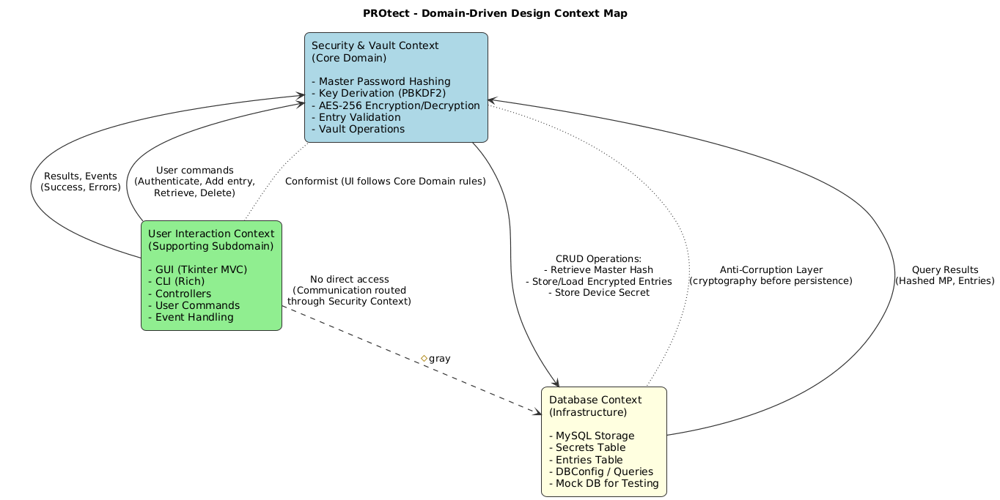
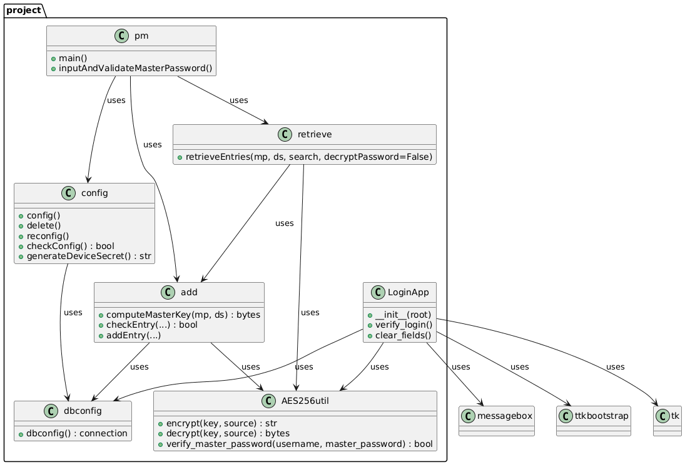
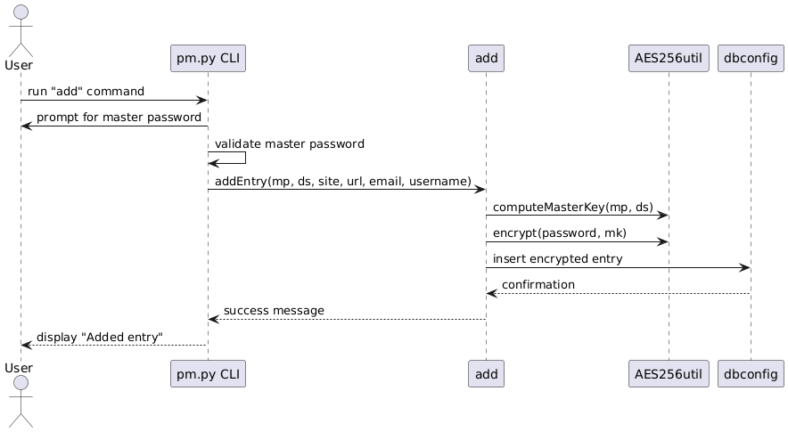
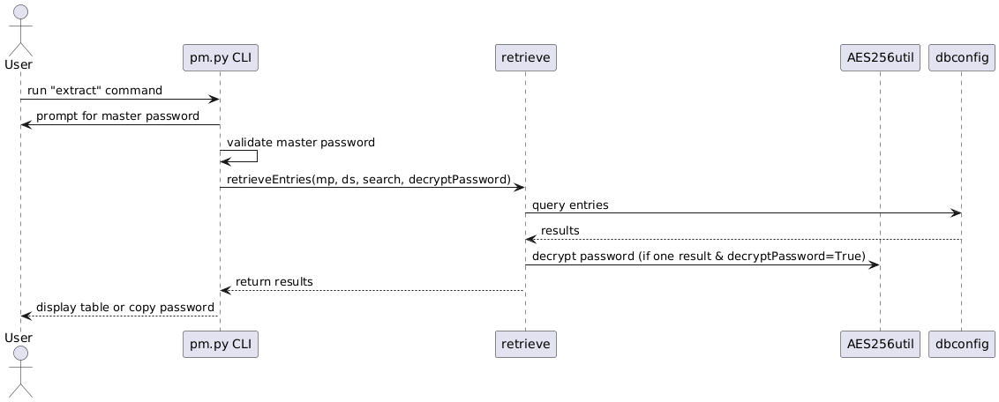
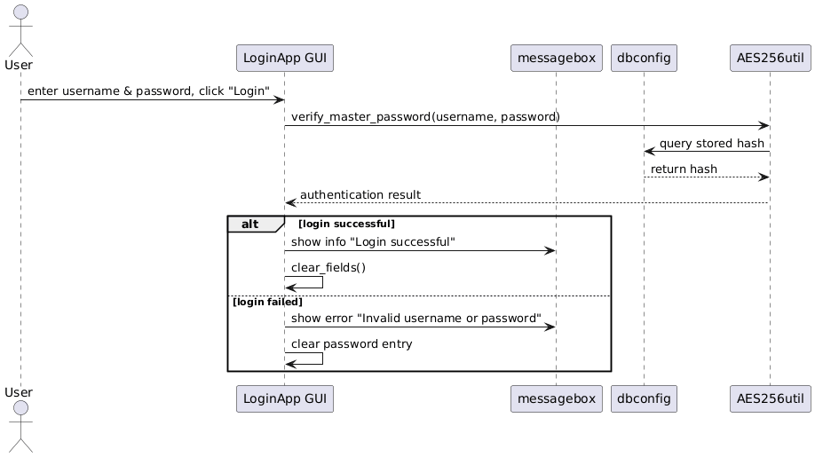
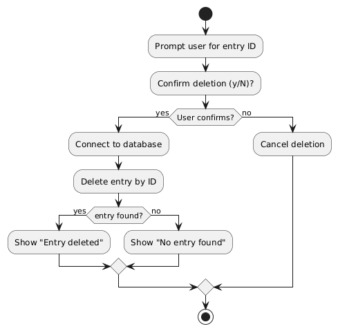
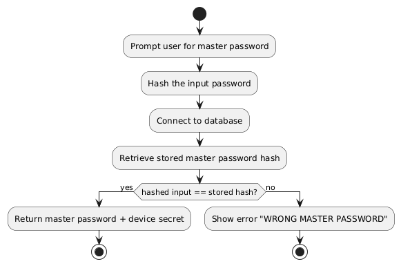

# Design

## Architecture 

Regarding the architecture of our project, we opted for a **LAYERED ARCHITECTURE**, where the *PRESENTATION LAYER* implies a Thkinter GUI with MCV (Model-Controller-View) separation and CLI for alternative interaction, *LOGIC LAYER* that handles cryptography, password operations, and orchestration between UI and DB, and *DATA LAYER* with a real MySQL backend, adding mock implementations for testing purposes. This is the classic layered structure where each component has its responsibility, the layers follow a "downward path" (from UI to Logic to DB), and the abstraction element is attributed by the simulated DB in testing (this has been done to avoid a real initial DB configuration every time we needed to test the GUI's functioning).
  
Inside these layers, it is clearly distinguishable a further object structure, involving users, entries, cryptographic utilities, database connections, SQL queries, libraries, and MCV itself is an object-based decomposition. As a matter of fact, OOP is good at modeling real-world concepts, making tests, maintenance and extension easier.
  
There is also an _event-based structure_ concerning GUI interactions through thkinter by means of buttons, clicks and similar, but it is not about the whole system. The events remain strictly related to the GUI.
  
There was no need to use other structures such as SHARED DATASPACE since we don't have independent subsystems communicating, yet the flow is quite linear with a user interacting with a GUI/CLI activaring the logic controller and automatically communicating with the database; or even a SERVICE-ORIENTED design which would not be applicable unless we split into microservices, which is not the case.

## More Details about the Architecture

The application is best described as following **3-Tier layered architecture**: 

- **PRESENTATION LAYER:** the UI, specifically a **GUI** (with Thkinter and MCV pattern) and a **CLI**. It is responsible for capturing users' inputs, showing results (outputs) and handling events like button clicks and other general commands. The MVC pattern, as the name suggests, divides the **MODEL** (what the application does or can do, it focuses purely on functionalities independently from the other two parties, it is about the application's core logic and data), the **VIEW** (what is shown to the user) and the **CONTROLLER** (the glue between the view and the model, it dictates how changes in the view are reflected in the model.
The controller is where we write what happens in reaction to input from the user, how the view should change and what functionality from the model should be triggered in response to inputs from the user). Such separation makes it **easier to test and debug** because parties do not interfere with one another (the UI does not deal with SQL and the DB does not have to do with GUI events), **testability** can be mocked so that the components are kept even more autonomous, it is **flexible** for changes (e.g., changing the technology from MySQL to SQLite someday) because we only need to modify the data layer and not the whole program, it is **maintainable** by adding new features extending the logic layer without touching the DB or UI code, and for **security** reasons keeping the cryptographic logic in the business logic reduces the risk of "mixing concerns" happening when different parts of a program are tangled together in the same place even if they focus on separate jobs; 

- **APPLICATION LAYER**: controllers and services that coordinate the workflow. It handles password encryption and consequent decryption, hashing methods (SHA256, PBKDF2 as derivative function to generate cryptographic keys starting from a password); 

- **DATA LAYER**: it is in charge of DB connection and queries handling, including a mock DB implementation for testing without accessing the real DB (otherwise we should remember to delete the created connection every time; the result of avoiding this step would be unsuccessful and incomplete testing and general conflicts during the implementation). 

### Diagram for the architecture

### Responsibilities of architectural components
**GUIview.py + Loginview.py**: it is in charge of rendering an easy-to-understand interface to the user, built via ttkboostrapt (tkinter) library and it's showed onto the display the user is interacting with (in our case, a computer desktop) 

**CLI** includes the whole codebase to use the application via command-line interface (always shown via display) without opening a GUI. it is connected to the rich library to display messages in the CLI in a nicer and colorful way also to let the user better understand what is happening 

**AES256util.py** it is an utility directly imported from github to insert the encryption base as reference for the rest of the project code (it is coupled with cryptography libraries)  

**config.py** represents the basic configuration of the application in order to create the database and the related tables ("SECRETS" for the master passwords coupled with salts for each user and "ENTRIES" to keep a record of all websites accessed by the users by means of a password). It connects to dbconfig.py to make all the configurations possible. It is also the initial configuration to choose the master password the first time and it generates the device secret (salt) associated to it to make the system safer and at each access it automatically checks for the correspondance.  

**dbconfig.py** creates the connection with mysql.connector in order to establish a connection to the db every time it is needed (also useful for first configuration) 

**retrieve.py** defines connection and queries to retrieve entries from the database and never shows the password in clear but copy to clipboard via pyperclip 

**add.py**  is the piece of code to add a new row in the table "ENTRIES" after checking if it already exists. This is possible if the user inserts the right master password, first. It is done to provide a further level of esecurity becasue it is not said that only because the application is already running the real owner of the account is still sitting in front of the desktop, and maybe he did not use the button "Lock" before stepping away and someone may have access to the hardware 

**GUIcontroller.py and Logincontroller.py** are the logic behind the actions that trigger the GUI (ex. puts into communication the view and the model when an action is triggered by the user by means of the GUI ex. clicking on a button). There is also the controller for the Login interface to access the application with the correct account (authentication). 

**GUImodel.py** is in charge of the queries to interact with the database and consequently performing CRUD and Import/Export operations (and any needed feature) 

## Modelling

### Domain driven design (DDD) modelling
The purpose of the DDD is a way to give a structure to the many operations to implement in the code, and to give a good structure we need to decompose functionalities into classes.  

We partition the domain of PROtect into three bounded contexts: 

- **Security and Vault Context (Core Domain)**: This is the heart of the application since it manages sensitive user data and enforces strong cryptography. It is responsible for Master password setup and validation, AES-256 encryption and decryption of stored entries for what it concerns passwords (via AES256util.py, PBKDF2, and other crypto utilities), secure management of the entries table in the database.
  
- **User Interaction Context (Supporting Subdomain)**: Provides users with ways to interact with the vault, both via command line and a graphical interface. It is responsible for CLI interface for adding, retrieving, and managing entries, GUI implementation following the MVC pattern: a Core GUI (GUIview.py, GUImodel.py, GUIcontroller.py) for main operations; and a Login/Signup GUI (Loginview.py, Logincontroller.py, Loginmodel.py) for first authentication.
  
- **Database context**: Encapsulates database configuration and storage details, which are necessary but not unique to the problem domain. It is responsible for managing MySQL connections and configuration (dbconfig.py especially for first configuration, and then general config.py), storing and retrieving encrypted entries and user data, exposing durable storage operations to the core logic. 

### Main Domain Concepts

**Entity**: An object that has a unique identity and can change over time.
**Value Object**: An object defined only by its attributes; it has no identity, making it interchangeable with any other value object with the same values.
**Aggregate Group**: A special type of entity that acts as the entry point for a group of related entities and value objects, ensuring consistency within the group.
**Factory**: An object or function responsible for creating other objects, often used when construction is complex or must follow specific rules.
**Repository**: An object that handles the retrieval and persistence of entities, typically supporting CRUD operations while hiding storage details.
**Service**: A stateless object that encapsulates business logic that does not naturally belong to an entity or value object; not necessarily a web service.
**Domain Event**: A record of something meaningful that happened within the domain and that the system may need to track or react to.

### Security and Vault Context

Entities:
- ENTRY (from entries table, managed in add.py and retrieve.py): identified by ID, website name, URL, username, email, -encrypted- password
- USER (implicitly from secrets table in config.py): has hashed master password and device secret.

Value Objects:
- MASTERKEY (in add.computeMasterKey/retrieve.computeMasterKey): derived from master password + device secret, immutable and interchangeable as long as values match
- ENCRYPTED PASSWORD (from AES256util.encrypt/decrypt): base64-encoded ciphertext, treated as a replaceable value

Factories:
- ComputeMasterKey (in add.py, retrieve.py): factory for MasterKey value objects
- generateDeviceSecret (in config.py): factory for a DS value object

Aggregate Roots:
- VAULT (implicit in how pm.py orchestrates add/retrieve): root aggregate managing Entry objects, controlled by verifying the MasterPassword
- USER SECRETS → aggregate grouping hashed masterpassword and DS (from secrets table), root for user authentication

Services:
- ENCRYPTION SERVICE (AES256util.encrypt/decrypt): encapsulates AES-256 logic
- AUTHENTICATION SERVICE (pm.inputAndValidateMasterPassword): validates master password hash against DB, returns the MasterKey material (the associated secrets)
- GENERATION OF DEVICE SECRET DS: the salt associated to the masterpassword
- PASSWORD VALIDATION SERVICE: checks on password policy

Repositories:
- ENTRIES TABLE (in MySQL DB): some of the CRUD operations (e.g., retrieve.retrieveEntries)
- SECRETS TABLE (in MYSQL DB): stores and retrieves and checks users' secrets

Domain Events: meaningful happenings around secrets and entries
- MasterPasswordSet: a new user registered, master password chosen and hashed, device secret generated.
- EntryAdded: a new password entry was created and stored securely.
- EntryDuplicatedAttempted: the system detected that an identical entry already exists.
- PasswordRetrieved: a password was decrypted and exposed only to clipboard.
- AuthenticationFailed: login attempt with wrong master password.
- AuthenticationSucceeded: master password verified, session established.

### User Interaction Context

Entities:
- LOGIN/SIGNUP SESSION: managed both by GUI and CLI
- INTERNAL SESSION: a logged-in state after password verification in an environment where to perform CRUD, import/export operations 

Value Objects:
- ARGPARSE in pm.py: immutable representation of user intent
- ResultView (ex. rich): tabular CLI view of entries; represents query results also on GUI, interchangeable across sessions.

Aggregates:
- None strongly present

Factories:
- None strongly present because CLI/GUI don't create domain objects directly

Services:
- APPLICATION SERVICE: orchestrates flow from user input -> domain logic -> persistence (db) ex. pm.py
- CONTROLLER SERVICE (GUIcontroller.py, Logincontroller.py): another application service, but it mediates between user actions and domain
- VIEW SERVICE (rich tables in CLI, GUIview.py, Loginview.py): presentation of domain objects

Domain Events: reflect user-facing activities in CLI or GUI flows
- CommandIssued: user invoked add, extract, etc (CRUD + import/export/lock).
- ResultsDisplayed: search results shown in table form.
- SessionStarted: after successful authentication in CLI or GUI.
- SessionEnded: implicit (after command completes, session closes).
- Login/RegistrationUIAccessed (planned for GUI): when login/signup view is opened).

### Database Context

Entities: 
- DATABASE CONNECTION (dbconfig.py): the active MySQL session identified by connection parameters
- ENTRIES TABLE: DB representing entries for the user.
- SECRETS TABLE: DB representing master password hash and device secret.

Value objects: 
- dbconfig parameters: connection details like website name, URL, username, email, password (immutable - does not change after its creation - and interchangeable - only attributes matter, no identifier)

Aggregates;
- None because this layer implements the infrastructure

Factories: 
- None either because connections are opened procedurally and not modeled as factories

Repositories:
- Implicit: persistence logic is spread across modules (config, add, retrieve) but collectively behaves as Entries and Secrets repositories.

Services:
- DB CONNECTION SERVICE: encapsulates MySQL connection logic

Domain Events: more technical but still meaningful at a system level
- DatabaseConnected: connection successfully established.
- DatabaseConnectionFailed: connection attempt failed.
- DatabaseCreated: schema PROtect created.
- TableCreated: entries and/or secrets table created.
- DatabaseWriteCommitted: new row committed.
- DatabaseQueryExecuted: any time SQL is run

### Object-oriented modelling

**Core application classes**
Our system is composed by several modules implementing configuration management (`config`), encryption (`AES256util`), database access (`dbconfig`), entry insertion (`add`), entry retrieval (`retrieve`), and GUI login (`LoginApp`). The main program (`pm`) orchestrates the workflow. The modules interact through clear “uses” relationships: `pm` relies on `config` and `retrieve`, cryptographic operations depend on `AES256util`, and database access is centralized in `dbconfig`. Tkinter classes are only used by `LoginApp`, keeping GUI logic separate from core business logic. Additionally, it operates with external library classes to provide the GUI interface (`messagebox`, `ttkbootstrap`, `tk`)

**pm**: is the *main entry point* of the entire program.
- `main()`: Starts the application workflow.
- `inputAndValidateMasterPassword()`: Asks the user for the master password and validates it.

**config**: it handles *initial configuration*, deletion of configuration, and validation.
- `config()`: Creates or loads configuration.
- `delete()`: Deletes existing configuration.
- `reconfig()`: Recreates configuration.
- `checkConfig() : bool`: Verifies that configuration is valid.
- `generateDeviceSecret() : str`: Creates a unique device secret used in key computation.

**add**: it handles adding new password entries to the database.
- `computeMasterKey(mp, ds) : bytes`: Generates the encryption key from master password and device secret.
- `checkEntry(...) : bool`: Validates whether an entry can be added (format and duplicates).
- `addEntry(...)`: Inserts a new encrypted entry into the database.

**retrieve**: it retrieves entries stored in the database.
- `retrieveEntries(mp, ds, search, decryptPassword=False)`: Searches entries and optionally decrypts stored passwords.

**dbconfig**: it takes care of the database connection.
- `dbconfig() : connection`: Creates and returns a connection to the database.

**AES256util**: it handles all cryptographic operations.
- `encrypt(key, source) : str`: Encrypts plaintext into ciphertext.
- `decrypt(key, source) : bytes`: Decrypts ciphertext.
- `verify_master_password(username, master_password) : bool`: Verifies if user authentication is valid.

**LoginApp**: it is the GUI class for user login.
- `__init__(root)`: Builds the GUI.
- `verify_login()`: Called when user presses login; checks the credentials.
- `clear_fields()`: Clears the input widgets.

### Relationships Between Data Types

#### **pm → uses → config**
The main program checks or builds configuration before anything else.

#### **pm → uses → retrieve**
The main program can retrieve password entries once authenticated.

#### **config → uses → dbconfig**

Configuration needs access to the database to create or modify config tables.

#### **add → uses → dbconfig**
Adding new entries requires writing into the database.

#### **add → uses → AES256util**
Because new entries must be encrypted with AES-256 before being stored.

#### **add → uses → config**
Because adding an entry requires the device secret (part of the config).

#### **retrieve → uses → add**
Retrieving requires computing the master key using `add.computeMasterKey`.

#### **retrieve → uses → AES256util**
Used for decrypting entries when required.

#### **retrieve → uses → dbconfig**
To read entries from the database.

#### **LoginApp → uses → AES256util**
Used to verify master password.

#### **LoginApp → uses → messagebox, ttkbootstrap, tk**
These external libraries build the GUI and show messages.

### In case of a distributed system
The system run locally, not distributed.
If distributed, domain concepts would map across services, but in this case everything is in a single machine with local DB connections.

## Interaction

In the CLI workflow, the interaction between components follows a request–reply pattern driven by user commands. The pm.py CLI acts as the orchestration layer: it receives user input, triggers internal logic, and coordinates calls to cryptographic and database modules. All components communicate through synchronous function calls.

CLI Sequential Diagram: Adding a password

In the picture here above, we represented the CLI sequential workflow of adding a password:

1. User runs pm add, CLI prompts for master password.
2. CLI calls addEntry(mp, ds, site, url, email, username).
3. Add module derives master key and encrypts the password via AES-256.
4. Encrypted entry stored in MySQL database.
5. Database confirms insertion and the CLI displays success.

CLI Sequential Diagram: Retrieving a password

In the picture here above, we represented the CLI sequential workflow of retrieving a password:

1. User runs pm extract and sequentially CLI prompts for master password.
2. CLI calls retrieveEntries(mp, ds, search, decryptPassword).
3. Retrieve module queries the MySQL database.
4. Database returns encrypted entries.
5. If a single entry and decryptPassword=True, then the retrieve command calls AES-256 to decrypt.
6. Decrypted password (or encrypted entries) returned to CLI.
7. CLI displays a table or copies password to clipboard (it does not show the password on the terminal)

GUI Sequential Diagram: Login Workflow

In the picture here above, we represented the GUI sequential login workflow:

1. User enters username and password, then clicks “Login” in the GUI.
2. GUI calls verify_master_password(username, password).
3. AES256util queries the dbconfig database for the stored hash.
4. Database returns the stored hash.
5. AES256util verifies the password and returns the authentication result. Consequentially, we can have two possible outcome: 
- Login Success: GUI displays “Login successful” via messagebox and the GUI clears all input fields.
- Login Failure: GUI displays “Invalid username or password” via messagebox and the GUI clears only the password entry.

In summary, the GUI manages all user interactions and presentation, while AES256util handles cryptographic verification and the database stores credentials. The entire flow is fully synchronous, layered, and unidirectional: User → GUI → AES256util → DB → AES256util → GUI → User.

## Behaviour

This section describes how each component behaves individually and how the system state is updated in response to user actions and internal events.

  
### Activity Diagram: Deletion Entry

This component manages the deletion of password or data entries by ID.
1. Waits for event: User provides entry ID. The deletion workflow is triggered by a user request.
2. Asks for confirmation (y/N). If user cancels, the workflow ends (no state changes).
3. On confirmation: connects to database. It sends a deletion command for the specified entry ID.
4. Database attempts deletion
- If entry with that ID exists → entry is removed (This is an update to persistent state)
- If entry does not exist → no modification to state
5. Displays result: 
- “Entry deleted” on success
- “No entry found” if ID was invalid

### Activity Diagram: Master Validation

This component is responsible for authenticating the user before granting access to sensitive operations.
1. Waits for event: User enters master password. The component is activated when the user provides a master password.
2. Hashes the input password. It transforms the provided password using a secure one-way hashing function.
- **Stateless behaviour**: The hashing operation itself is stateless, it simply takes input and produces output.
3. Requests stored hash from the database. The component sends a query to the database layer to retrieve the stored master password hash. This is a state read operation.
4. Compares input hash with stored hash
- If the hashes match, the authentication success
- If they do not match, the authentication fails and the error is shown
5. **On success**: returns master password + device secret. This transitions the system into an authenticated state. 
**Stateful behaviour**: The authentication module becomes stateful only when it updates session or security state.
6. **On failure**: produces an error event. No state is changed.

## Data-related aspects (in case persistent storage is needed)

The system stores two main types of data in a MySQL relational database. The first is the **SECRETS** table, which contains the hashed master password, device secret (salt), and username. This table is essential for authentication and secure key derivation. The second is the **ENTRIES** table, which includes fields such as id, website, url, username/email, and the encrypted password, providing persistent storage for user vault entries. Data is stored in a structured relational format to ensure consistent schema, support easy CRUD operations, allow atomic updates, and maintain stability and safety across multiple sessions.

Various components interact with the database at different times. The config component queries the database during the first setup to create the schema and initialize secrets. The add component inserts encrypted entries when new vault items are added. The retrieve component reads and decrypts entries when users request them, and the pm component may access the database on startup to check configuration. Since the system is single-user and single-process, there are no concurrency issues; MySQL automatically ensures consistency, and no additional locking or transactions are required beyond the default commits.

Shared data exists between components where necessary: the master password hash and device secret are shared across authentication components, while the entries table is accessed by both CLI and GUI interactions. There is no in-memory shared state, as coordination occurs entirely through the database.
