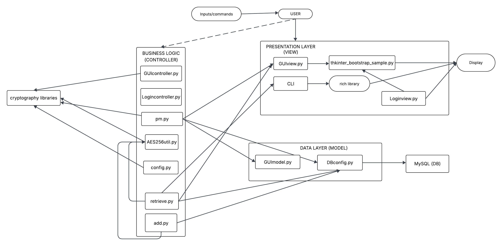

# Design

## Architecture 

- We opted for a **LAYERED ARCHITECTURE**, where the *PRESENTATION LAYER* implies a Thkinter GUI with MCV separation and CLI for alternative interaction, *LOGIC LAYER* that handles cryptography, password operations, and orchestration between UI and DB, and *DATA LAYER* with a real MySQL backend, adding mock implementations for testing purposes. This is the classic layered structure where each component has its responsibility, the layers follow a "downward path" (from UI to Logic to DB), and the abstraction element is attributed by the simulated DB in testing (this has been done to avoid a real initial DB configuration every time we needed to test the GUI's functioning).
- Inside these layers, it is clearly distinguishable a further object/component structure, involving users, entries, cryptographic utilities, database connections, SQL queries, libraries, and MVC itself is an object-based decomposition. As a matter of fact, OOP is good at modeling real-world concepts, making tests, maintenance and extension easier.
- There is also an event-based structure concerning GUI interactions through thkinter by means of buttons, clicks and similar, but it is not about the whole system. The events remain strictly related to the GUI.
- There was no need to use other structures such as SHARED DATASPACE since we don't have independent subsystems communicating, yet the flow is quite linear with a user interacting with a GUI/CLI activaring the logic controller and automatically communicating with the database; or even a SERVICE-ORIENTED design which would not be applicable unless we split into microservices, which is not the case.

## More Details about the Architecture
The application is best described as following **3-Tier layered architecture**:
- PRESENTATION LAYER: the UI, specifically a **GUI** (with Thkinter and MCV pattern) and a **CLI**. It is responsible for capturing users' inputs, showing results (outputs) and handling events like button clicks and other general commands. The MVC pattern, as the name suggests, divides the **MODEL** (what the application does or can do, it focuses purely on functionalities independently from the other two parties, it is about the application's core logic and data), the **VIEW** (what is shown to the user) and the **CONTROLLER** (the glue between the view and the model, it dictates how changes in the view are reflected in the model. The controller is where we write what happens in reaction to input from the user, how the view should change and what functionality from the model should be triggered in response to inputs from the user). Such separation makes it **easier to test and debug** because parties do not interfere with one another (the UI does not deal with SQL and the DB does not have to do with GUI events), **testability** can be mocked so that the components are kept even more autonomous, it is **flexible** for changes (e.g., changing the technology from MySQL to SQLite someday) because we only need to modify the data layer and not the whole program, it is **maintainable** by adding new features extending the logic layer without touching the DB or UI code, and for **security** reasons keeping the cryptographic logic in the business logic reduces the risk of "mixing concerns" happening when different parts of a program are tangled together in the same place even if they focus on separate jobs;
- APPLICATION LAYER: controllers and services that coordinate the workflow. It handles password encryption and consequent decryption, hashing methods (SHA256, PBKDF2 as derivative function to generate cryptographic keys starting from a password);
- DATA LAYER: it is in charge of DB connection and queries handling, including a mock DB implementation for testing without accessing the real DB (otherwise we should remember to delete the created connection every time; the result of avoiding this step would be unsuccessful and incomplete testing and general conflicts during the implementation).

### Diagram for the architecture

### Responsibilities of architectural components
GUIview.py + Loginview.py -> it is in charge of rendering an easy-to-understand interface to the user, built via ttkboostrapt (tkinter) library and it's showed onto the display the user is interacting with (in our case, a computer desktop)
CLI -> includes the whole codebase to use the application via command-line interface (always shown via display) without opening a GUI. it is connected to the rich library to display messages in the CLI in a nicer and colorful way also to let the user better understand what is happening
AES256util.py -> utility directly imported from github to insert the encryption base as reference for the rest of the project code (it is coupled with cryptography libraries) 
config.py -> represents the basic configuration of the application in order to create the database and the related tables ("SECRETS" for the master passwords coupled with salts for each user and "ENTRIES" to keep a record of all websites accessed by the users by means of a password). It connects to dbconfig.py to make all the configurations possible. It is also the initial configuration to choose the master password the first time and it generates the device secret (salt) associated to it to make the system safer and at each access it automatically checks for the correspondance. 
dbconfig.py -> creates the connection with mysql.connector in order to establish a connection to the db every time it is needed (also useful for first configuration)
retrieve.py -> defines connection and queries to retrieve entries from the database and never shows the password in clear but copy to clipboard via pyperclip
add.py -> it is the piece of code to add a new row in the table "ENTRIES" after checking if it already exists. This is possible if the user inserts the right master password, first. It is done to provide a further level of esecurity becasue it is not said that only because the application is already running the real owner of the account is still sitting in front of the desktop, and maybe he did not use the button "Lock" before stepping away and someone may have access to the hardware
GUIcontroller.py è Logincontroller.py -> the logic behind the actions that trigger the GUI (ex. puts into communication the view and the model when an action is triggered by the user by means of the GUI ex. clicking on a button). There is also the controller for the Login interface to access the application with the correct account (authentication).
GUImodel.py -> it's in charge of the queries to interact with the database and consequently performing CURD and Import/Export operations (and any needed feature)

## Infrastructure (mostly applies to distributed systems)

- Are there **infrastructural components** that need to be introduced? Which and **how many** of each?
    - e.g. **clients**, **servers**, **load balancers**, **caches**, **databases**, **message brokers**, **queues**, **workers**, **proxies**, **firewalls**, **CDNs**, etc.
- How do components **distribute** over the network? **Where** are they located?
    - e.g. do servers / brokers / databases / etc. sit on the same machine? on the same network? on the same datacenter? on the same continent?
- How do components **find** each other?
    - How to **name** components?
    - e.g. **DNS**, **service discovery**, **load balancing**, etc.

> UML deployment diagrams are welcome here

## Modelling

### Domain driven design (DDD) modelling
The purpose of the DDD is a way to give a structure to the many operations to implement in the code, and to give a good structure we need to decompose functionalities into classes. 
We partition the domain of PROtect into three bounded contexts: 
- **Security and Vault Context (Core Domain)**: This is the heart of the application since it manages sensitive user data and enforces strong cryptography. It is responsible for Master password setup and validation, AES-256 encryption and decryption of stored entries for what it concerns passwords (via AES256util.py, PBKDF2, and other crypto utilities), secure management of the entries table in the database.
- **User Interaction Context (Supporting Subdomain)**: Provides users with ways to interact with the vault, both via command line and a graphical interface. It is responsible for CLI interface for adding, retrieving, and managing entries, GUI implementation following the MVC pattern: a Core GUI (GUIview.py, GUImodel.py, GUIcontroller.py) for main operations; and a Login/Signup GUI (Loginview.py, Logincontroller.py, Loginmodel.py) for first authentication.
- **Database context**: Encapsulates database configuration and storage details, which are necessary but not unique to the problem domain. It is responsible for managing MySQL connections and configuration (dbconfig.py especially for first configuration, and then general config.py), storing and retrieving encrypted entries and user data, exposing durable storage operations to the core logic. 

### Domain Concepts
ENTITY -> object with an identifier, can change overtime  
VALUE OBJECT -> we only care about the attributes, without ID so interchangeable  
AGGREGATE ROOT -> a sort of entity, but groups simpler entities or value objects  
FACTORY -> objects aimed at creating other objects  
REPOSITORY -> objects mediating the persistent storage/retrieval of other objects (ex. supports CRUD operations)  
SERVICE -> functional objects encapsulating the business logic of the software. It is not forcely about web services, but to whatever python object encapsulating the business logic of other entities  
 
**Security and Vault Context**
**ENTITIES**
- ENTRY (from entries table, managed in add.py and retrieve.py): identified by ID, website name, URL, username, email, -encrypted- password
- USER (implicitly from secrets table in config.py): has hashed master password and device secret.
**VALUE OBJECTS**
- MASTERKEY (in add.computeMasterKey/retrieve.computeMasterKey): derived from master password + device secret, immutable.
- ENCRYPTED PASSWORD (from AES256util.encrypt/decrypt): base64-encoded ciphertext.
**FACTORIES**
- Not explicit, but we could consider "ComputeMasterKey" a kinf od factory for MasterKey since it produces the derived value object. 
**AGGREGATES**
- VAULT (implicit in how pm.py orchestrates add/retrieve): root aggregate managing Entry objects, controlled by verifying the MasterPassword.
**SERVICES**
- ENCRYPTION SERVICE (AES256util.encrypt/decrypt): encapsulates AES-256 encryption/decryption.
- AUTHENTICATION SERVICE (pm.inputAndValidateMasterPassword): validates master password hash against DB, returns the MasterKey material.
- GENERATION OF DEVICE SECRET DS: the salt associated to the masterpassword
**REPOSITORY**
- ENTRIES TABLE (in MySQL DB): some of the CRUD operations (e.g., retrieve.retrieveEntries)
- SECRETS TABLE (in MYSQL DB)
 

**User Interaction Context**
**ENTITIES**
- LOGIN/SIGNUP SESSION (Logincontroller.py, Loginview.py, Loginmodel.py): managed both by GUI and CLI
- INTERNAL SESSION (GUIview.py, GUIcontroller.py, GUImodel.py): a logged-in state after password verification in an environment where to perform CRUD, import/export operations 
**VALUE OBJECTS**
- argparse in pm.py: immutable representation of user intent (add/extract).
- ResultView (from retrieve.retrieveEntries): tabular CLI view of entries.
**AGGREGATES**
- CONTROLLER (implicit, business logic): orchestrates operations
**SERVICES**
- Controller (pm.py, GUIcontroller.py, Logincontroller.py): interprets input, validates, and delegates to domain functions.
- View (rich tables, GUIview.py, Loginview.py): presentation of vault data.
 

**Database Context**
**ENTITIES**
- DatabaseConnection (dbconfig.py): MySQL session.
- Entries Table: DB representing entries for the user.
- Secrets Table: DB representing master password hash and device secret.
**VALUE OBJECTS**
- dbconfig parameters: connection details like website name, URL, username, email, password
**AGGREGATES**
- None
**DOMAIN SERVICES**
- Repository (split across add.py, retrieve.py, config.py): CRUD operations for the app (insert new entry and secrets, get the queried entry)

- Are there repositories, services, or factories for each/any domain concept?
- What are the relavant domain events in each context?

> Context map diagrams are welcome here

### Object-oriented modelling

- What are the main data types (e.g. classes) of the system?
- What are the main attributes and methods of each data type?
- How do data types relate to each other?

> UML class diagrams are welcome here

### In case of a distributed system

- How do the domain concepts map to the architectural or infrastuctural components?
    + i.e. which architectural/component is responsible for which domain concept?
    + are there data types which are required onto multiple components? (e.g. messages being exchanged between components)

- What are the domain concepts or data types which represent the state of the distributed system?
    + e.g. state of a video game on central server, while inputs/representations on clients
    + e.g. where to store messages in an instant-messaging app? for how long?

- Are there domain concepts or data types which represent messages being exchanged between components?
    + e.g. messages between clients and servers, messages between servers, messages between clients

## Interaction

- How do components *communicate*? *When*? *What*?

- Which **interaction patterns** do they enact?

> UML sequence diagrams are welcome here

## Behaviour

- How does **each** component *behave* individually (e.g., in *response* to *events* or messages)?
    + Some components may be *stateful*, others *stateless*

- Which components are in charge of updating the **state** of the system? *When*? *How*?

> UML state diagrams or activity diagrams are welcome here

## Data-related aspects (in case persistent storage is needed)

- Is there any data that needs to be stored?
    - *What* data? *Where*? *Why*?

- How should **persistent data** be **stored**? Why?
    - e.g., relations, documents, key-value, graph, etc.

- Which components perform queries on the database?
    - *When*? *Which* queries? *Why*?
    - Concurrent read? Concurrent write? Why?

- Is there any data that needs to be shared between components?
    - *Why*? *What* data?

